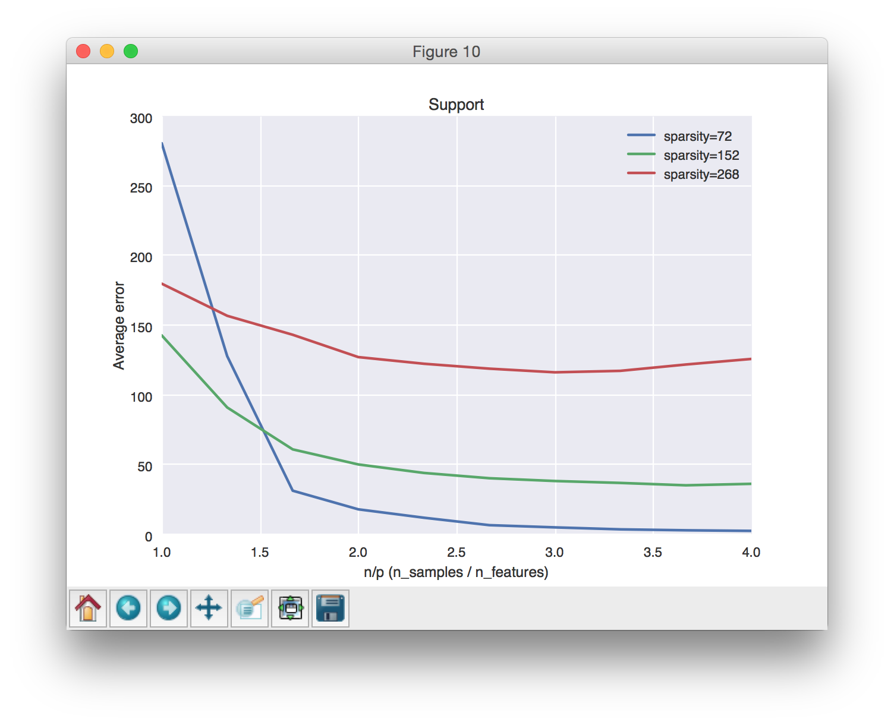
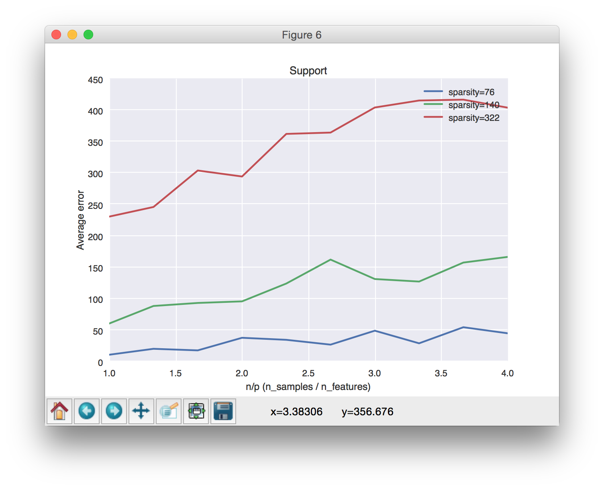
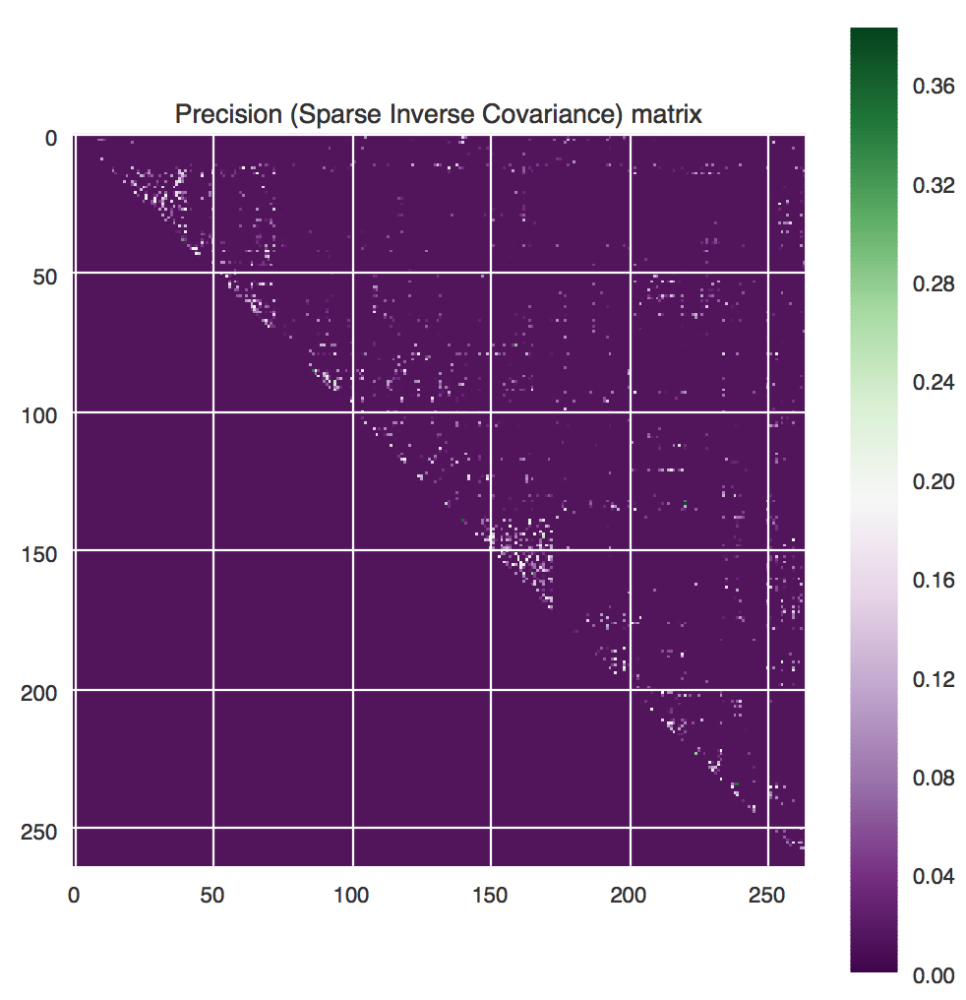
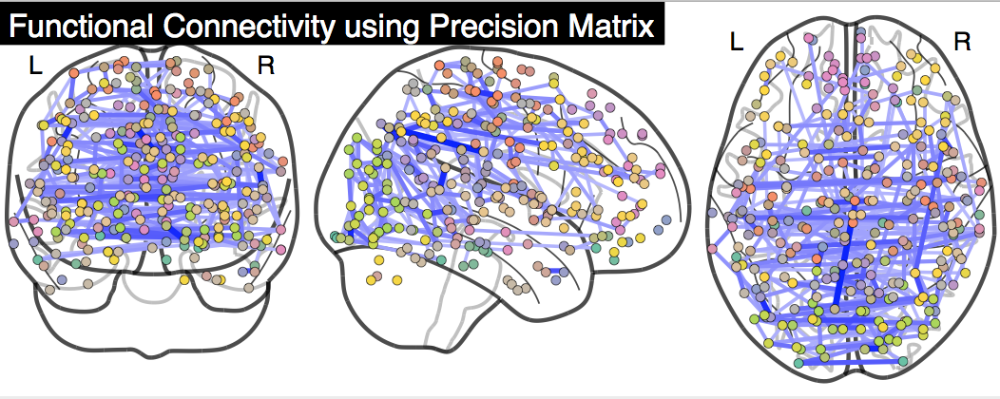

# skggm : Gaussian graphical models in scikit-learn
In the last decade, learning networks that encode conditional indepedence relationships has become an  important problem in machine learning and statistics. For many important probability distributions, such as multivariate Gaussians, this amounts to estimation of inverse covariance matrices. Inverse covariance estimation is now used widely in infer gene regulatory networks in cellular biology and neural interactions in the neuroscience. 

However, many statistical advances and best practices in fitting such models to data are not yet widely adopted and not available in common python packages for machine learning. Furthermore, inverse covariance estimation is an active area of research where researchers continue to improve algorithms and estimators.
With `skggm` we seek to provide these new developments to a wider audience, and also enable researchers to effectively benchmark their methods in regimes relevant to their applications of interest.

While `skggm` is currently geared toward "Gaussian graphical models", we hope to eventually evolve it to support "Generalized graphical models".

## Inverse Covariance Estimation

Given **n** independently drawn, **p**-dimensional Gaussian random samples , the maximum likelihood estimate of the inverse covariance matrix  can be computed via the _graphical lasso_, i.e., the program

where  is a symmetric non-negative weight matrix and

 

is a regularization term that promotes sparsity \[[Hsieh et al.](http://jmlr.org/papers/volume15/hsieh14a/hsieh14a.pdf)\]. This is a generalization of the scalar  formulation found in \[[Friedman et al.](http://statweb.stanford.edu/~tibs/ftp/glasso-bio.pdf)\] and implemented [here](http://scikit-learn.org/stable/modules/generated/sklearn.covariance.GraphLassoCV.html).

In this package we provide a [scikit-learn](http://scikit-learn.org)-compatible implementation of the program above and a collection of modern best practices for working with the graphical lasso.  To get started, test out 

    
    from inverse_covariance import QuicGraphLassoCV
    
    model = QuicGraphLassoCV()
    model.fit(X)                   # X is matrix of shape (n_samples, n_features) 
    
    # outputs: model.covariance_, model.precision_, model.lam_

and then head over to `examples/estimator_suite.py` for other example usage.
<!-- and read our walk through at [https://jasonlaska.github.io/skggm/walkthrough](https://jasonlaska.github.io/skggm/walk_through). -->

---

This is an ongoing effort. We'd love your feedback on which algorithms and techniques we should include and how you're using the package. We also welcome contributions. 

[@jasonlaska](https://github.com/jasonlaska) and [@mnarayn](https://github.com/mnarayan)

---

## Included in `inverse_covariance` 
- **QuicGraphLasso** [[doc]](https://github.com/jasonlaska/skggm/blob/master/inverse_covariance/quic_graph_lasso.py#L138-L239)

    _QuicGraphLasso_ is an implementation of [QUIC](http://jmlr.org/papers/volume15/hsieh14a/hsieh14a.pdf) wrapped as a scikit-learn compatible estimator \[[Hsieh et al.](http://jmlr.org/papers/volume15/hsieh14a/hsieh14a.pdf)\] . The estimator can be run in `default` mode for a fixed penalty or in `path` mode to explore a sequence of penalties efficiently.  The penalty `lam` can be a scalar or matrix.

    The primary outputs of interest are: `covariance_`, `precision_`, and `lam_`.  

    The interface largely mirrors the built-in _[GraphLasso](http://scikit-learn.org/stable/modules/generated/sklearn.covariance.GraphLasso.html)_ although some param names have been changed (e.g., `alpha` to `lam`). Some notable advantages of this implementation over _GraphLasso_ are support for a matrix penalization term and speed.

- **QuicGraphLassoCV** [[doc]](https://github.com/jasonlaska/skggm/blob/master/inverse_covariance/quic_graph_lasso.py#L372-L468)
    
    _QuicGraphLassoCV_ is an optimized cross-validation model selection implementation similar to scikit-learn's _[GraphLassoCV](http://scikit-learn.org/stable/modules/generated/sklearn.covariance.GraphLassoCV.html)_. As with _QuicGraphLasso_, this implementation also supports matrix penalization.

- **QuicGraphLassoEBIC** [[doc]](https://github.com/jasonlaska/skggm/blob/master/inverse_covariance/quic_graph_lasso.py#L644-L717)

    _QuicGraphLassoEBIC_ is provided as a convenience class to use the _Extended Bayesian Information Criteria_ (EBIC) for model selection \[[Foygel et al.](https://papers.nips.cc/paper/4087-extended-bayesian-information-criteria-for-gaussian-graphical-models)\].  

- **ModelAverage** [[doc]](https://github.com/jasonlaska/skggm/blob/master/inverse_covariance/model_average.py#L72-L172)
    
    _ModelAverage_ is an ensemble meta-estimator that computes several fits with a user-specified `estimator` and averages the support of the resulting precision estimates.  The result is a `proportion_` matrix indicating the sample probability of a non-zero at each index. This is a similar facility to scikit-learn's _[RandomizedLasso](http://scikit-learn.org/stable/modules/generated/sklearn.linear_model.RandomizedLasso.html)_) but for the graph lasso.

    In each trial, this class will:

    1. Draw bootstrap samples by randomly subsampling **X**.

    2. Draw a random matrix penalty.

    The random penalty can be chosen in a variety of ways, specified by the `penalization` parameter.  This technique is also known as _stability selection_ or _random lasso_.

- **AdaptiveGraphLasso** [[doc]](https://github.com/jasonlaska/skggm/blob/master/inverse_covariance/adaptive_graph_lasso.py#L13-L48)

    _AdaptiveGraphLasso_ performs a two step estimation procedure: 
    
    1. Obtain an initial sparse estimate. 

    2. Derive a new penalization matrix from the original estimate.  We currently provide three methods for this: `binary`, `1/|coeffs|`, and `1/|coeffs|^2`.  The `binary` method only requires the initial estimate's support (and this can be be used with _ModelAverage_ below).

    This technique works well to refine the non-zero precision values given a reasonable initial support estimate.

- **inverse_covariance.plot_util.trace_plot**

    Utility to plot `lam_` paths.

- **inverse_covariance.profiling**

    Submodule that includes `profiling.AverageError`, `profiling.StatisticalPower` to compare performance between methods.  This is a work in progress, more to come soon!

## Installation

Clone this repo and run

    python setup.py install

or via PyPI

    pip install skggm

or from a cloned repo
    
    cd inverse_covariance/pyquic
    make 

**The package requires that `numpy`, `scipy`, and `cython` are installed independently into your environment first.**

If you would like to fork the pyquic bindings directly, use the Makefile provided in `inverse_covariance/pyquic`.

## Tests
To run the tests, execute the following lines.  

    python -m pytest inverse_covariance/tests/
    python -m pytest inverse_covariance/profiling/tests

# Examples

## Usage 
In `examples/estimator_suite.py` we reproduce the [plot_sparse_cov](http://scikit-learn.org/stable/auto_examples/covariance/plot_sparse_cov.html) example from the scikit-learn documentation for each method provided (however, the variations chosen are not exhaustive).

An example run for `n_examples=100` and `n_features=20` yielded the following results. 

For slightly higher dimensions of `n_examples=600` and `n_features=120` we obtained:

## Plotting the regularization path
We've provided a utility function `inverse_covariance.plot_util.trace_plot` that can be used to display the coefficients as a function of `lam_`.  This can be used with any estimator that returns a path.  The example in `examples/trace_plot_example.py` yields:

## Profiling utilities
We've provided some utilities in `inverse_covariance.profiling` to compare performance across the estimators. 

For example, below is the comparison of the average support error between `QuicGraphLassoCV` and its randomized model average equivalent (the example found in `examples/compare_model_selection.py`).  The support error of `QuicGraphLassoCV` is dominated by the false-positive rate which grows substantially as the number of samples grows.

## Brain network functional connectivity
In `examples/plot_functional_brain_networks.py` and the corresponding Jupyter notebook `example/ABIDE_Example`, we plot the functional connectivity of brain-wide networks learned from the observation data (similar example to [this example](http://nilearn.github.io/auto_examples/03_connectivity/plot_inverse_covariance_connectome.html#sphx-glr-auto-examples-03-connectivity-plot-inverse-covariance-connectome-py)).

Specifically, we extract the time-series from the ABIDE dataset, with nodes defined using regions of interest from the [Power-264 atlas (Power, 2011)](http://www.ncbi.nlm.nih.gov/pmc/articles/PMC3222858/). The image on the left shows the upper triangle of the resulting precision matrix and the image on the right shows a top-of-brain connectome depicting the functional connectivity between different locations on XXX.  

# References

### BIC / EBIC Model Selection

* ["Extended Bayesian Information Criteria for Gaussian Graphical Models"](https://papers.nips.cc/paper/4087-extended-bayesian-information-criteria-for-gaussian-graphical-models) R. Foygel and M. Drton NIPS 2010

### QuicGraphLasso / QuicGraphLassoCV

* ["QUIC: Quadratic Approximation for sparse inverse covariance estimation"](http://jmlr.org/papers/volume15/hsieh14a/hsieh14a.pdf) by C. Hsieh, M. A. Sustik, I. S. Dhillon, P. Ravikumar, Journal of Machine Learning Research (JMLR), October 2014.

* QUIC implementation found [here](http://www.cs.utexas.edu/~sustik/QUIC/) and [here](http://bigdata.ices.utexas.edu/software/1035/) with cython bindings forked from [pyquic](https://github.com/osdf/pyquic)

### Adaptive refitting (two-step methods)

* ["High dimensional covariance estimation based on Gaussian graphical models"](http://www.jmlr.org/papers/volume12/zhou11a/zhou11a.pdf) S. Zhou, P. R{\"u}htimann, M. Xu, and P. B{\"u}hlmann

* ["Relaxed Lasso"](http://stat.ethz.ch/~nicolai/relaxo.pdf) N. Meinshausen, December 2006.

### Randomized model averaging 

* ["Stability Selection"](https://arxiv.org/pdf/0809.2932v2.pdf) N. Meinhausen and P. Buehlmann, May 2009

* ["Random Lasso"](https://arxiv.org/abs/1104.3398) S. Wang, B. Nan, S. Rosset, and J. Zhu, Apr 2011
            
* ["Mixed effects models for resampled network statistics improves statistical power to find differences in multi-subject functional connectivity"](http://biorxiv.org/content/early/2016/03/14/027516) M. Narayan and G. Allen, March 2016

### Convergence test

* ["The graphical lasso: New Insights and alternatives"](https://web.stanford.edu/~hastie/Papers/glassoinsights.pdf) Mazumder and Hastie, 2012.

