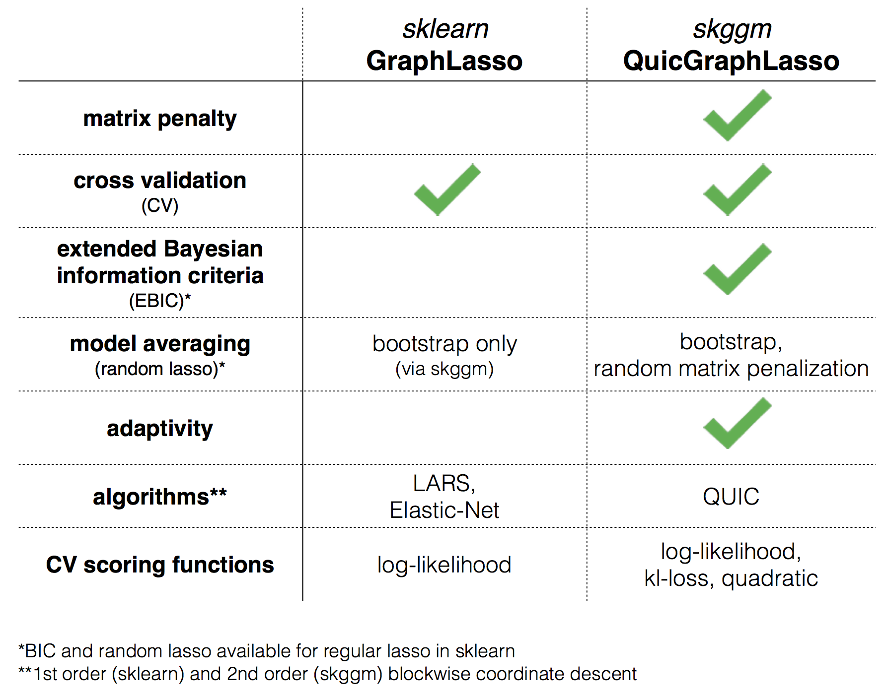
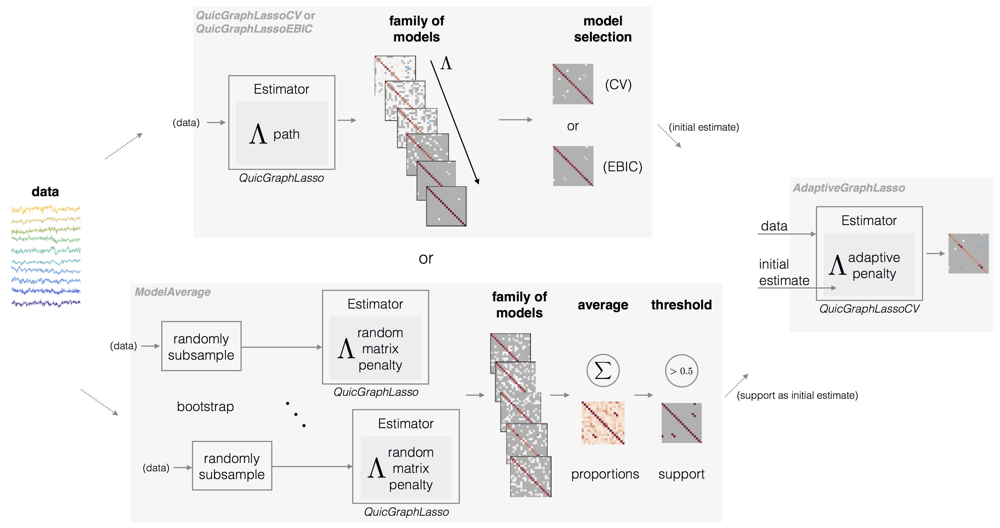
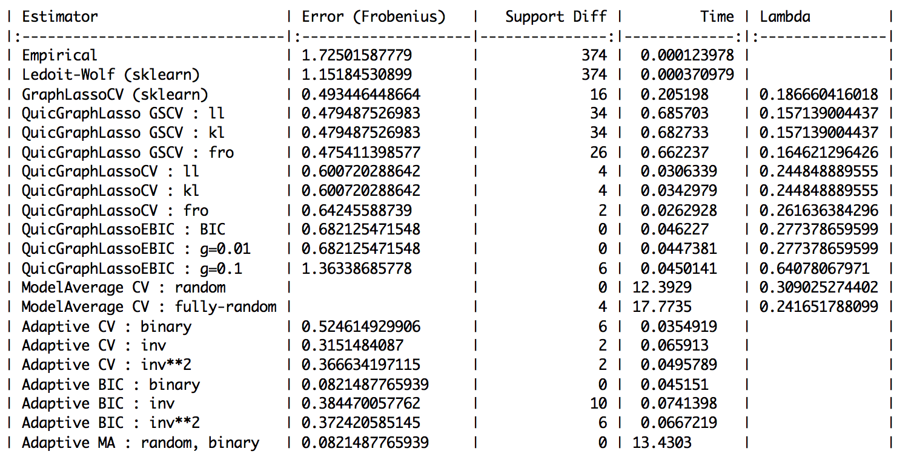
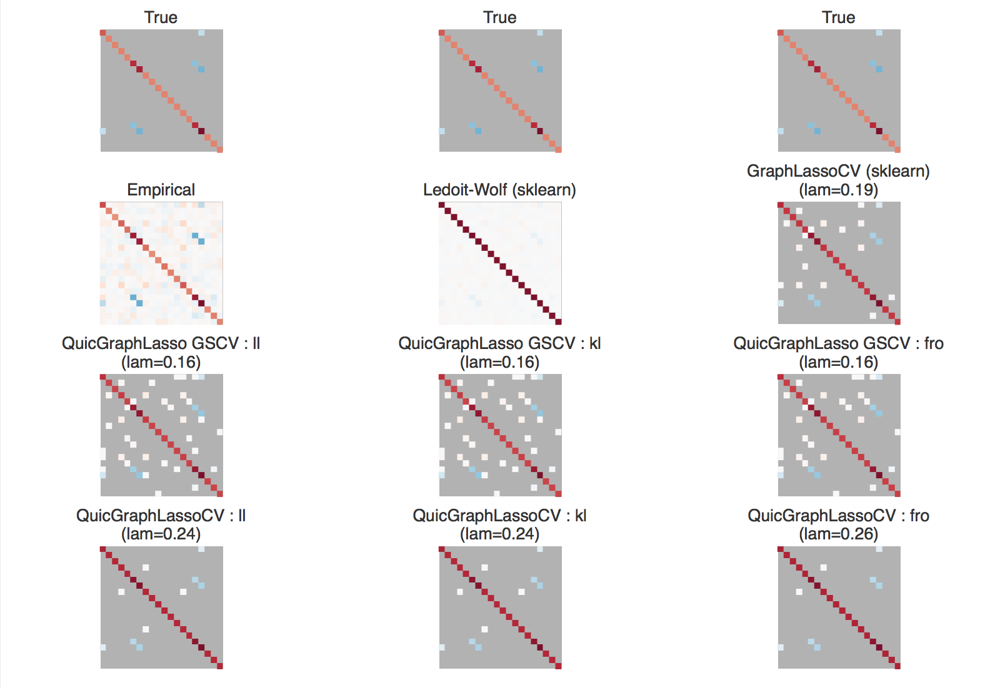
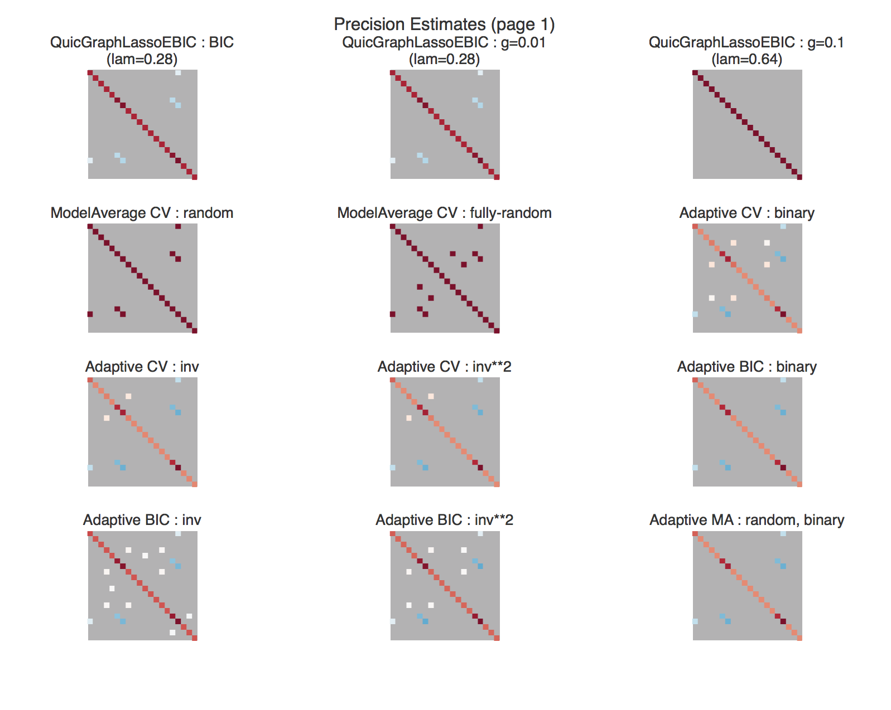
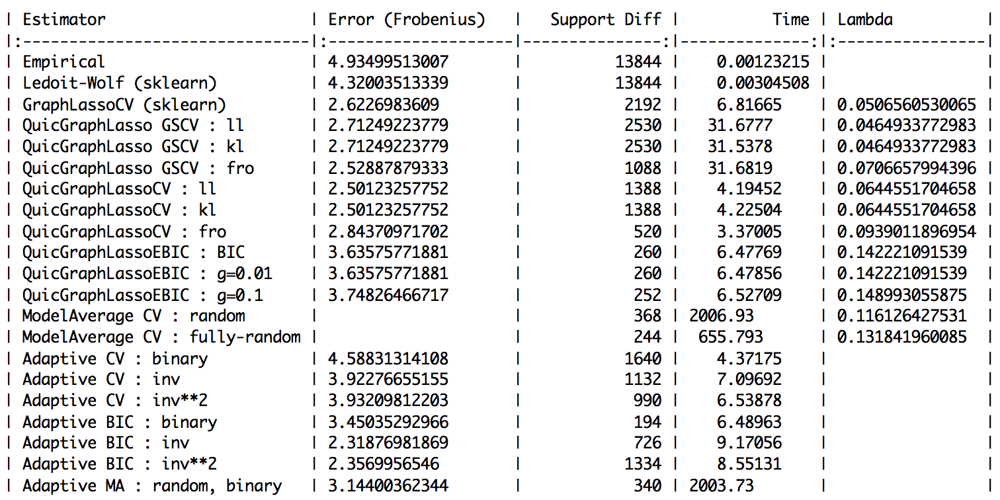
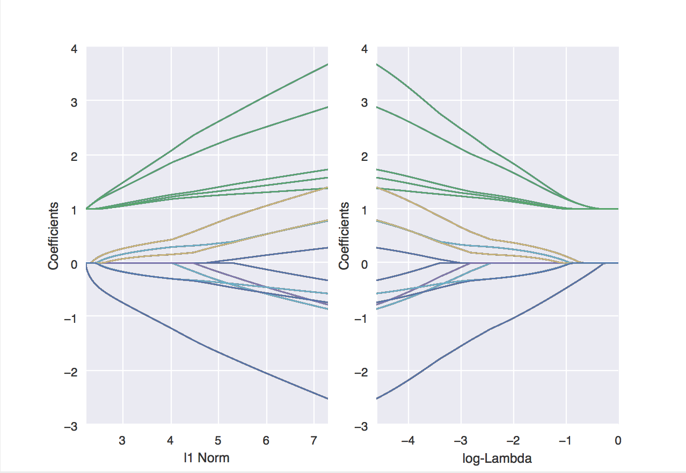

[](https://travis-ci.org/skggm/skggm)
[](https://badge.fury.io/gh/skggm%2Fskggm)
[](https://doi.org/10.5281/zenodo.830033)


# skggm : Gaussian graphical models using the scikit-learn API
In the last decade, learning networks that encode conditional independence relationships has become an  important problem in machine learning and statistics. For many important probability distributions, such as multivariate Gaussians, this amounts to estimation of inverse covariance matrices. Inverse covariance estimation is now used widely in infer gene regulatory networks in cellular biology and neural interactions in the neuroscience.

However, many statistical advances and best practices in fitting such models to data are not yet widely adopted and not available in common python packages for machine learning. Furthermore, inverse covariance estimation is an active area of research where researchers continue to improve algorithms and estimators.
With `skggm` we seek to provide these new developments to a wider audience, and also enable researchers to effectively benchmark their methods in regimes relevant to their applications of interest.

While `skggm` is currently geared toward _Gaussian graphical models_, we hope to eventually evolve it to support _General graphical models_.  Read more [here](https://skggm.github.io/skggm/tour).


## Inverse Covariance Estimation

Given **n** independently drawn, **p**-dimensional Gaussian random samples  with sample covariance , the maximum likelihood estimate of the inverse covariance matrix  can be computed via the _graphical lasso_, i.e., the program

<p align="center"></p>

where  is a symmetric matrix with non-negative entries and

<p align="center"></p>

Typically, the diagonals are not penalized by setting  to ensure that  remains positive definite. The objective reduces to the standard graphical lasso formulation of [Friedman et al.](http://statweb.stanford.edu/~tibs/ftp/glasso-bio.pdf) when all off diagonals of the penalty matrix take a constant scalar value . The standard graphical lasso has been implemented in [scikit-learn](http://scikit-learn.org/stable/modules/generated/sklearn.covariance.GraphLassoCV.html).

In this package we provide a [scikit-learn](http://scikit-learn.org)-compatible implementation of the program above and a collection of modern best practices for working with the graphical lasso. A rough breakdown of how this package differs from scikit's built-in `GraphLasso` is depicted by this chart:
<p align="center"></p>

### Quick start
To get started, install the package (via pip, see below) and:

- read the tour of skggm at [https://skggm.github.io/skggm/tour](https://skggm.github.io/skggm/tour)
- read [@mnarayan](https://github.com/mnarayan)'s [talk](https://dx.doi.org/10.6084/m9.figshare.4003380) and check out the companion examples [here](https://github.com/neuroquant/jf2016-skggm) (live via binder at [here](http://mybinder.org/repo/neuroquant/jf2016-skggm)). Presented at HHMI, Janelia Farms, October 2016.
- basic usage examples can be found in [examples/estimator_suite.py](https://github.com/skggm/skggm/blob/master/examples/estimator_suite.py)

---

This is an ongoing effort. We'd love your feedback on which algorithms and techniques we should include and how you're using the package. We also welcome contributions.

[@jasonlaska](https://github.com/jasonlaska) and [@mnarayan](https://github.com/mnarayan)

---

## Included in `inverse_covariance`
An overview of the skggm graphical lasso facilities is depicted by the following diagram:
<p align="center"></p>

Information on basic usage can be found at [https://skggm.github.io/skggm/tour](https://skggm.github.io/skggm/tour).  The package includes the following classes and submodules.

- **QuicGraphicalLasso** [[doc]](https://github.com/skggm/skggm/blob/master/inverse_covariance/quic_graph_lasso.py#L165)

    _QuicGraphicalLasso_ is an implementation of [QUIC](http://jmlr.org/papers/volume15/hsieh14a/hsieh14a.pdf) wrapped as a scikit-learn compatible estimator \[[Hsieh et al.](http://jmlr.org/papers/volume15/hsieh14a/hsieh14a.pdf)\] . The estimator can be run in `default` mode for a fixed penalty or in `path` mode to explore a sequence of penalties efficiently.  The penalty `lam` can be a scalar or matrix.

    The primary outputs of interest are: `covariance_`, `precision_`, and `lam_`.

    The interface largely mirrors the built-in _[GraphLasso](http://scikit-learn.org/stable/modules/generated/sklearn.covariance.GraphLasso.html)_ although some param names have been changed (e.g., `alpha` to `lam`). Some notable advantages of this implementation over _GraphicalLasso_ are support for a matrix penalization term and speed.

- **QuicGraphicalLassoCV** [[doc]](https://github.com/skggm/skggm/blob/master/inverse_covariance/quic_graph_lasso.py#L444)

    _QuicGraphicalLassoCV_ is an optimized cross-validation model selection implementation similar to scikit-learn's _[GraphLassoCV](http://scikit-learn.org/stable/modules/generated/sklearn.covariance.GraphLassoCV.html)_. As with _QuicGraphicalLasso_, this implementation also supports matrix penalization.

- **QuicGraphicalLassoEBIC** [[doc]](https://github.com/skggm/skggm/blob/master/inverse_covariance/quic_graph_lasso.py#L809)

    _QuicGraphicalLassoEBIC_ is provided as a convenience class to use the _Extended Bayesian Information Criteria_ (EBIC) for model selection \[[Foygel et al.](https://papers.nips.cc/paper/4087-extended-bayesian-information-criteria-for-gaussian-graphical-models)\].

- **ModelAverage** [[doc]](https://github.com/skggm/skggm/blob/master/inverse_covariance/model_average.py#L180)

    _ModelAverage_ is an ensemble meta-estimator that computes several fits with a user-specified `estimator` and averages the support of the resulting precision estimates.  The result is a `proportion_` matrix indicating the sample probability of a non-zero at each index. This is a similar facility to scikit-learn's _[RandomizedLasso](http://scikit-learn.org/stable/modules/generated/sklearn.linear_model.RandomizedLasso.html)_) but for the graph lasso.

    In each trial, this class will:

    1. Draw bootstrap samples by randomly subsampling **X**.

    2. Draw a random matrix penalty.

    The random penalty can be chosen in a variety of ways, specified by the `penalization` parameter.  This technique is also known as _stability selection_ or _random lasso_.

- **AdaptiveGraphicalLasso** [[doc]](https://github.com/skggm/skggm/blob/master/inverse_covariance/adaptive_graph_lasso.py#L10)

    _AdaptiveGraphicalLasso_ performs a two step estimation procedure:

    1. Obtain an initial sparse estimate.

    2. Derive a new penalization matrix from the original estimate.  We currently provide three methods for this: `binary`, `1/|coeffs|`, and `1/|coeffs|^2`.  The `binary` method only requires the initial estimate's support (and this can be be used with _ModelAverage_ below).

    This technique works well to refine the non-zero precision values given a reasonable initial support estimate.

- **inverse_covariance.plot_util.trace_plot**

    Utility to plot `lam_` paths.

- **inverse_covariance.profiling**

    The `.profiling` submodule contains a `MonteCarloProfiling()` class for evaluating  methods over different graphs and metrics.  We currently include the following graph types:

        - LatticeGraph
        - ClusterGraph
        - ErdosRenyiGraph (via sklearn)

    An example of how to use these tools can be found in `examples/profiling_example.py`.

## Parallelization Support

`skggm` supports parallel computation through [joblib](http://pythonhosted.org/joblib/) and [Apache Spark](http://spark.apache.org/).  Independent trials, cross validation, and other _embarrassingly parallel_ operations can be farmed out to multiple processes, cores, or worker machines.  In particular,

- `QuicGraphicalLassoCV`
- `ModelAverage`
- `profiling.MonteCarloProfile`

can make use of this through either the `n_jobs` or `sc` (sparkContext) parameters.

Since these are naive implementations, it is not possible to enable parallel work on all three of objects simultaneously when they are being composited together. For example, in this snippet:

    model = ModelAverage(
        estimator=QuicGraphicalLassoCV(
            cv=2,
            n_refinements=6,
        )
        penalization=penalization,
        lam=lam,
        sc=spark.sparkContext,
    )
    model.fit(X)

only one of `ModelAverage` or `QuicGraphicalLassoCV` can make use of the spark context. The problem size and number of trials will determine the resolution that gives the fastest performance.


## Installation

Both python2.7 and python3.6.x are supported. We use the [black autoformatter](https://github.com/ambv/black) to format our code. If contributing, please run this formatter checks will fail.

Clone this repo and run

    python setup.py install

or via PyPI

    pip install skggm

or from a cloned repo

    cd inverse_covariance/pyquic
    make
    make python3  (for python3)

**The package requires that `numpy`, `scipy`, and `cython` are installed independently into your environment first.**

If you would like to fork the pyquic bindings directly, use the Makefile provided in `inverse_covariance/pyquic`.

This package requires the `lapack` libraries to by installed on your system. A configuration example with these dependencies for Ubuntu and Anaconda 2 can be found [here](https://github.com/neuroquant/jf2016-skggm/blob/master/Dockerfile#L8-L13).

## Tests
To run the tests, execute the following lines.

    python -m pytest inverse_covariance (python3 -m pytest inverse_covariance)
    black --check inverse_covariance
    black --check examples

# Examples

## Usage
In `examples/estimator_suite.py` we reproduce the [plot_sparse_cov](http://scikit-learn.org/stable/auto_examples/covariance/plot_sparse_cov.html) example from the scikit-learn documentation for each method provided (however, the variations chosen are not exhaustive).

An example run for `n_examples=100` and `n_features=20` yielded the following results.

<p align="center"></p>

<p align="center"></p>

<p align="center"></p>

For slightly higher dimensions of `n_examples=600` and `n_features=120` we obtained:

<p align="center"></p>

## Plotting the regularization path
We've provided a utility function `inverse_covariance.plot_util.trace_plot` that can be used to display the coefficients as a function of `lam_`.  This can be used with any estimator that returns a path.  The example in `examples/trace_plot_example.py` yields:

<p align="center"></p>

# Citation

If you use *skggm* or reference our blog post in a presentation or publication, we would appreciate citations of our package.

>Jason Laska, Manjari Narayan, 2017. _skggm 0.2.7: A scikit-learn compatible package for Gaussian and related Graphical Models._ doi:10.5281/zenodo.830033

Here is the corresponding Bibtex entry
```
@misc{laska_narayan_2017_830033,
  author       = {Jason Laska and
                  Manjari Narayan},
  title        = {{skggm 0.2.7: A scikit-learn compatible package for
                   Gaussian and related Graphical Models}},
  month        = jul,
  year         = 2017,
  doi          = {10.5281/zenodo.830033},
  url          = {https://doi.org/10.5281/zenodo.830033}
}
```

# References

### BIC / EBIC Model Selection

* ["Extended Bayesian Information Criteria for Gaussian Graphical Models"](https://papers.nips.cc/paper/4087-extended-bayesian-information-criteria-for-gaussian-graphical-models) R. Foygel and M. Drton NIPS 2010

### QuicGraphicalLasso / QuicGraphicalLassoCV

* ["QUIC: Quadratic Approximation for sparse inverse covariance estimation"](http://jmlr.org/papers/volume15/hsieh14a/hsieh14a.pdf) by C. Hsieh, M. A. Sustik, I. S. Dhillon, P. Ravikumar, Journal of Machine Learning Research (JMLR), October 2014.

* QUIC implementation found [here](http://www.cs.utexas.edu/~sustik/QUIC/) and [here](http://bigdata.ices.utexas.edu/software/1035/) with cython bindings forked from [pyquic](https://github.com/osdf/pyquic)

### Adaptive refitting (two-step methods)

* ["High dimensional covariance estimation based on Gaussian graphical models"](http://www.jmlr.org/papers/volume12/zhou11a/zhou11a.pdf) S. Zhou, P. R{\"u}htimann, M. Xu, and P. B{\"u}hlmann

* ["Relaxed Lasso"](http://stat.ethz.ch/~nicolai/relaxo.pdf) N. Meinshausen, December 2006.

### Randomized model averaging

* ["Stability Selection"](https://arxiv.org/pdf/0809.2932v2.pdf) N. Meinhausen and P. Buehlmann, May 2009

* ["Random Lasso"](https://arxiv.org/abs/1104.3398) S. Wang, B. Nan, S. Rosset, and J. Zhu, Apr 2011

* ["Mixed effects models for resampled network statistics improves statistical power to find differences in multi-subject functional connectivity"](http://biorxiv.org/content/early/2016/03/14/027516) M. Narayan and G. Allen, March 2016

### Convergence test

* ["The graphical lasso: New Insights and alternatives"](https://web.stanford.edu/~hastie/Papers/glassoinsights.pdf) Mazumder and Hastie, 2012.

### Repeated KFold cross-validation

* ["Cross-validation pitfalls when selecting and assessing regression and classification models"](https://www.ncbi.nlm.nih.gov/pmc/articles/PMC3994246/) D. Krstajic, L. Buturovic, D. Leahy, and S. Thomas, 2014.
